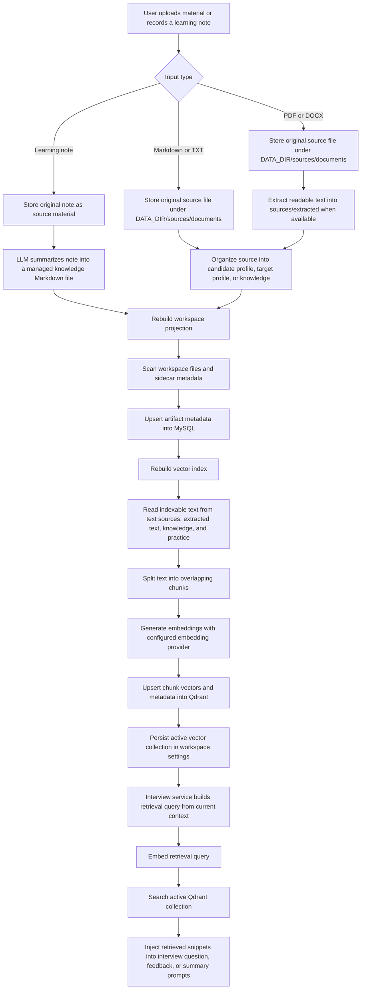

# Knowledge Base Data Flow

This document describes the current Auto Reign knowledge-base flow for uploaded
materials, learning notes, workspace projection, chunking, embeddings, vector
indexing, and retrieval.

## Current Storage Responsibilities

- `DATA_DIR/sources/documents/` stores original uploaded files and original
  learning-note sources. Source files keep the user's original filename in
  metadata and display it in the library.
- `DATA_DIR/sources/extracted/` stores extracted text for PDF and DOCX inputs
  when readable text can be extracted.
- `DATA_DIR/knowledge/`, `DATA_DIR/profile/`, `DATA_DIR/practice/`,
  `DATA_DIR/state/`, and `DATA_DIR/reports/` store managed Markdown artifacts.
- MySQL stores the projection of workspace artifacts, processing status, index
  status, revisions, and session/report metadata.
- Qdrant stores searchable chunk vectors. The active Qdrant collection can be
  rebuilt from the filesystem workspace and MySQL artifact projection.

## Indexing Rules

- Markdown and TXT source files are indexed directly from the original source.
- PDF and DOCX source files are not indexed directly; their extracted Markdown
  artifact is indexed when extraction succeeds.
- Knowledge and practice Markdown artifacts are indexed from their body content.
- Candidate profile, target profile, plans, reports, and mastery state remain
  visible in the library but are not currently part of the vector index.
- A deleted library artifact removes the matching workspace file and the
  projection is rebuilt. Index rebuild then removes stale vector content by
  publishing a fresh active collection.
