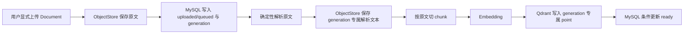

# Knowledge Collection 数据流

聊天附件、Agent Home 和 Knowledge 是三种不同来源：聊天附件绑定一条 User Message，并在该消息进入有界历史窗口时作为消息上下文；Agent Home 是可写、可演进的长期文件权威源，通过精确文件工具访问；Knowledge 是用户或管理员显式维护的只读参考资料，只有 Knowledge Document 会进入 Qdrant。

本文是 Knowledge Collection、Knowledge Document、ObjectStore、索引 Worker、Qdrant 与聊天 Runtime 的当前数据流权威。通用资源、权限、Runtime 和预算边界见[通用 Agent 平台架构](workbench-architecture.md)。

## 当前范围

当前实现包括：

- `resources` 表中的 `knowledge_collection` typed resource；
- `/api/knowledge-collections` 和管理员领域 API；
- `/knowledge` 与 `/admin/knowledge` 管理页面；
- Agent `knowledge_scopes` 的整库或 Document 子集绑定；
- `knowledge_documents` 状态、对象引用、内容 hash 和 `index_generation`；
- 显式 Document 上传、预览、下载、重新索引和删除；
- 只从持久状态领取工作的进程内索引 Worker；
- generation 专属解析对象和 Qdrant point；
- 绑定 Knowledge 后才向主聊天 LLM 暴露的 `search_knowledge(query)`。

同一个 Agent 可以同时绑定 Agent Home 和多个 Knowledge Collection。两类 Capability 互不复制，主 LLM 按当前问题决定是否及以何种顺序调用。

## 数据权威边界

| 存储 | 权威职责 |
| --- | --- |
| ObjectStore | Knowledge Document 原始文件和 generation 专属完整解析文本 |
| MySQL | Collection/Document owner、对象 Key、内容 hash、状态、当前 `index_generation`、错误和时间戳 |
| Qdrant | 从当前解析文本确定性切分、可重建的原文 chunk 向量投影 |

Qdrant 不保存业务权威数据。删除 point、索引损坏或服务不可用，都不能删除或改写原始文件和完整解析文本。恢复索引只能从 ObjectStore 与 MySQL 当前 generation 重建，不能从 Qdrant、聊天回答或生成式摘要反推来源。

## 入库与重新索引



Document 状态主线为：

```text
uploaded -> queued -> processing -> ready
                            \-> failed
```

规则如下：

1. 上传必须针对明确 Collection；聊天附件不会隐式创建 Knowledge Document。
2. 接口先把原始文件写入 ObjectStore，再在 MySQL 创建可追踪 Document；任一步失败都不能留下伪装成 ready 的记录。
3. 文档解析和 chunk 由确定性应用代码完成。LLM 不改写原文或决定持久化格式，Embedding 模型只生成向量。
4. 每次上传或重新索引使用新的 `index_generation`；完整解析文本和 point 都属于该 generation。
5. Worker 只有在任务 generation 仍是 Document 当前 generation 时，才能把 MySQL 状态条件更新为 `ready`。
6. 迟到旧任务不能覆盖当前状态；其对象或 point 即使清理失败残留，也不能进入直接原文或向量检索。
7. 新 generation 发布后再 best-effort 清理旧解析对象和 point。清理失败不改变当前可见内容，也不删除 source object。
8. `failed` 不无限自动重试；用户通过管理界面显式重新索引。启动时只恢复持久化 queued 或超时 processing 工作。

`index_generation` 同时隔离 MySQL 状态、parsed object 和 Qdrant point，不只是一个展示字段。

## Qdrant 投影

每个 point 的 ID 和 payload 都必须能服务端校验，至少包含：

- owner；
- Collection ID；
- Document ID；
- `index_generation`；
- 内容 hash；
- chunk 起止位置和顺序；
- 文件名等来源标识；
- 确定性切分得到的原文片段。

查询 filter 由应用根据认证用户、本轮冻结的 Agent scope、active Document 和当前 generation 强制添加。模型只能提交 `query`，不能提交 owner、Collection、Document、generation 或 filter 来扩大范围。

旧 generation point 可以在清理失败时残留，但任何查询都必须同时匹配有效 scope、active/ready 状态和当前 generation。Qdrant 返回的 payload 也不能直接信任；应用会回读权威解析对象并逐项验证 hash、字符范围和逐字内容。

## Agent 绑定语义

Agent `knowledge_scopes` 支持多个 Collection：

- `document_ids=null` 表示整库；以后新增并进入 ready 的 Document 自动进入有效范围；
- 非空 `document_ids` 表示精确子集；
- 空数组没有语义，拒绝保存；
- global Agent 只能绑定 global Collection；
- private Agent 可以绑定自己的 private Collection 或 global Collection；
- 保存 Agent 时在同一事务中校验 owner、可见性、active、tombstone 和 Document 归属。

每个新轮次解析最新 Agent 配置并冻结该轮有效 Knowledge scope。已经开始的工具循环不会因管理员中途修改 Agent 而改变范围，下一轮才读取新配置。

## 检索：直接原文与 RAG

主聊天 LLM 根据用户问题和 Agent Prompt 决定是否调用 `search_knowledge(query)`。平台不会在主模型前固定运行 Retrieval Agent，也不使用关键词规则强制每轮检索。

`search_knowledge` 使用确定性的 `auto` 路由：

1. 服务端根据用户、本轮 Agent scope、Collection/Document 状态和 generation 解析有效来源。
2. 若全部有效来源的完整解析文本能放入本轮剩余预算，直接读取并返回权威 parsed object。
3. 若完整原文超出预算，使用主 LLM 提供的 query 在 Qdrant 检索当前范围、当前 generation 的候选 chunk。
4. 应用回读权威解析对象，验证候选 metadata、hash、字符范围和逐字内容。
5. ToolResult 返回有界原文、Collection、Document、文件名、chunk 位置、score 和稳定引用。

只有第 3 步属于向量 RAG。直接原文与向量路径共享完全相同的权限、Document 状态、来源引用和上下文预算，不能因使用 RAG 扩大范围。

Qdrant 不可用，或者候选 metadata、score、generation、hash、范围、parsed object 不合法时，工具 fail-closed 返回稳定的 `knowledge_unavailable`，不能伪装成“没有结果”。直接原文路径发现来源损坏时也不能回退到二手投影掩盖故障。

RAG 返回确定性切分得到的原文片段，不返回生成式摘要。当前不启用：

- query rewriting；
- 独立 Retrieval Agent；
- MultiQuery 或 HyDE；
- LLM rerank；
- 生成式摘要检索；
- Agent Home 文件索引。

## LLM 与确定性代码分工

| 环节 | 主聊天 LLM | Embedding 模型 | 确定性应用代码 |
| --- | --- | --- | --- |
| 判断是否需要 Knowledge | 决定是否调用工具 | 否 | 只提供已授权能力 |
| 生成检索 query | 是 | 否 | 校验 schema、长度和预算 |
| 解析 Agent 绑定范围 | 否 | 否 | 校验用户、Collection、Document、active 和 generation |
| 选择直接原文或向量检索 | 否 | 否 | 根据完整文本大小与剩余预算决定 |
| 文档解析与 chunk | 否 | 否 | 是 |
| 生成向量 | 否 | 是 | 调度并写入投影 |
| Qdrant 查询与 filter | 否 | 否 | 是 |
| 验证并回读权威原文 | 否 | 否 | 是 |
| 根据来源生成回答 | 是 | 否 | 提供片段和引用 |

LLM 没有 DB Session、ObjectStore client 或 Qdrant client。它只能提出 schema 校验后的工具调用；权限、范围收窄、预算、状态机和持久化由应用代码执行。

Knowledge Tool audit 可以保存有界的 Collection、Document、文件名、generation、内容 hash、chunk 位置和 score 等来源身份，但不保存 Knowledge 正文、Object Key、query、Provider payload 或模型返回的任意 metadata。审计不是下一轮内容权威。

## 生命周期与删除

- private Collection/Document 使用实际用户 ID，只对 owner 可管理；
- global Collection/Document 使用 owner sentinel `0`，它不代表可登录用户；
- 只有 `ready + active + current generation` 的 Document 可进入检索；
- 被 active Agent 引用的 Collection 不能停用或删除；
- 被精确 `document_ids` 引用的 Document 不能删除；
- 整库绑定不阻止删除其中单个 Document。

允许删除的 Document 先在 MySQL 把 `is_active` 设为 false，并以 cleanup-pending 状态从检索范围隔离，再清理当前及旧 generation 的 Qdrant point、parsed object 和 source object。外部清理失败时保留 `knowledge_cleanup_failed` 和 HTTP `202 cleanup_pending`，由管理者显式重试；系统不能静默改写 Agent 配置或把失败伪装成删除完成。

原文解析、Embedding 或 Qdrant 写入失败不会删除 source object。用户可以在修复配置或外部服务后显式重新索引。

## 与附件和 Agent Home 的关系

```text
聊天附件 -> 所属 User Message 与有界历史窗口
聊天附件 -X-> Agent Home
聊天附件 -X-> Knowledge Document
聊天附件 -X-> Qdrant

Agent Home -> ObjectStore 权威文件与精确文件工具
Agent Home -X-> Knowledge Document
Agent Home -X-> Qdrant

Knowledge Document -> ObjectStore 权威原文/解析文本
Knowledge Document -> Qdrant 可重建 chunk 投影
```

用户上传内容、解析文本和检索 chunk 都是不可信来源，不能覆盖平台 Prompt、Agent Prompt、工具 schema、用户隔离或持久化协议。

## Worker 与恢复边界

索引 Worker 只把 `knowledge_documents` 持久状态作为领取、恢复与发布的权威。当前 Worker 与 SSE/取消运行在同一 FastAPI 进程，不使用内存队列、额外 Job 表、Redis、Celery 或独立 worker container。

进程退出不会丢失队列语义；重启从 MySQL 恢复安全工作。Qdrant 可从 ObjectStore 与 MySQL 重建，不能成为恢复原文的来源。
