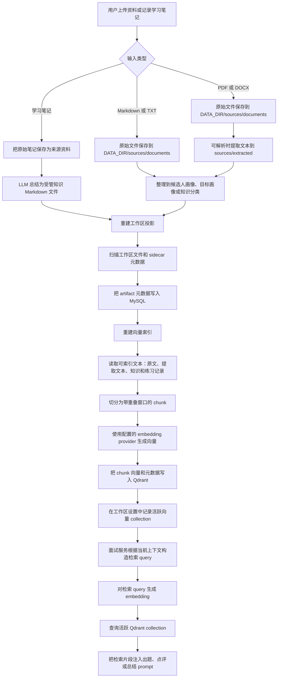

# 资料库数据流

本文描述 Auto Reign 当前资料库从上传资料、学习记录、工作区投影、切块、embedding、向量索引到面试检索的完整流程。

## 当前存储职责

- `DATA_DIR/sources/documents/` 保存用户上传的原始文件和学习笔记原文。来源文件会在元数据中保留用户的原始文件名，并在资料库中展示该名称。
- `DATA_DIR/sources/extracted/` 保存 PDF 和 DOCX 输入可解析出的文本。
- `DATA_DIR/knowledge/`、`DATA_DIR/profile/`、`DATA_DIR/practice/`、`DATA_DIR/state/` 和 `DATA_DIR/reports/` 保存系统管理的 Markdown 资产。
- MySQL 保存工作区 artifact 投影、处理状态、索引状态、修订版本、会话和报告元数据。
- Qdrant 保存可检索的 chunk 向量。活跃 Qdrant collection 可以从文件工作区和 MySQL artifact 投影重新构建。

## 索引规则

- Markdown 和 TXT 来源文件直接从原始文件索引。
- PDF 和 DOCX 来源文件不直接索引；解析成功后索引对应的提取文本 Markdown artifact。
- 知识和练习 Markdown artifact 从正文内容索引。
- 候选人画像、目标画像、计划、报告和掌握状态会展示在资料库中，但当前不进入向量索引。
- 删除资料库 artifact 时，系统删除对应工作区文件并重建投影。随后索引重建会发布新的活跃 collection，从而移除陈旧向量内容。
