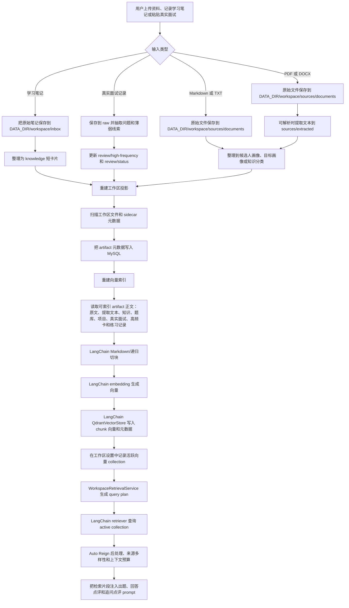

# 资料库数据流

本文描述 Auto Reign 当前资料库从上传资料、学习记录、真实面试记录、工作区投影、切块、embedding、向量索引到面试检索的完整流程。

## 当前存储职责

- `DATA_DIR/workspace/inbox/` 保存“新学习”自由文本输入的原始记录。它作为 source provenance 使用，不由 AI 覆盖。
- `DATA_DIR/workspace/sources/documents/` 保存用户上传的原始文件。来源文件会在元数据中保留用户的原始文件名，并在资料库中展示该名称。
- `DATA_DIR/workspace/sources/extracted/` 保存 PDF 和 DOCX 输入可解析出的文本。
- `DATA_DIR/workspace/knowledge/`、`DATA_DIR/workspace/questions/`、`DATA_DIR/workspace/projects/`、`DATA_DIR/workspace/raw/`、`DATA_DIR/workspace/review/`、`DATA_DIR/workspace/profile/`、`DATA_DIR/workspace/practice/`、`DATA_DIR/workspace/state/` 和 `DATA_DIR/workspace/reports/` 保存系统管理的 Markdown 资产。
- MySQL 保存工作区 artifact 投影、处理状态、索引状态、修订版本、会话和报告元数据。
- Qdrant 保存可检索的 chunk 向量。活跃 Qdrant collection 可以从文件工作区和 MySQL artifact 投影重新构建。LangChain 负责 Markdown/递归切块、embedding、QdrantVectorStore 写入和 retriever 查询，Auto Reign 负责 workspace 协议、provenance、可索引规则、active collection 发布、检索后处理和上下文预算。

## 索引规则

- Markdown 和 TXT 上传来源文件直接从原始文件索引。
- `inbox/` 中的新学习原始记录直接索引。
- PDF 和 DOCX 来源文件不直接索引；解析成功后索引对应的提取文本 Markdown artifact。
- 知识、题库、项目、真实面试、高频复盘和练习 Markdown artifact 从正文内容索引。新学习生成的知识文件使用「我的理解 / 修正/补充 / 30 秒面试说法 / 易混点 / 追问」短卡片格式，并按标题 slug 合并到同一个 `knowledge/<主题>.md`。
- 答差或缺失点会沉淀为 `questions/<题目>.md`，结构包含「考察点 / 标准回答 / 结合项目 / 常见追问 / 易错点 / 复习状态」。
- 真实面试粘贴记录会保存到 `raw/`，并更新 `review/high-frequency.md` 与 `review/status.md`。
- 候选人画像、目标画像、复习状态、报告和掌握状态会展示在资料库中，但报告和掌握状态当前不进入向量索引。报告是展示产物，不作为事实来源进入检索。
- 删除资料库 artifact 时，系统删除对应工作区文件并重建投影。随后索引重建会发布新的活跃 collection，从而移除陈旧向量内容。

`POST /api/workspace/rebuild-index` 保留为诊断 API，用于手工重建 Qdrant collection。资料库主界面不展示该能力，普通学习流程不要求用户理解索引或 collection。

## 当前重点展示

工作台首页读取 `review/status.md` 中的“当前重点”，最多展示 3 个抽检重点。重点来自模拟练习或真实面试记录暴露出的薄弱点；单纯上传、阅读或编辑资料只会更新“最近整理”，不会直接证明掌握状态。

## 面试点评检索

面试出题先读取候选人画像、目标画像、掌握状态、复习状态和高频问题，再使用用户自然语言提示、当前题目和轮次构造检索 query plan。项目深挖模式会优先加入 `projects/` 材料。LangChain retriever 只查询当前 workspace active collection；Auto Reign 会对结果做分数阈值、单 artifact 上限、来源多样性和上下文预算控制。回答点评和追问点评会额外结合当前题目、用户回答、项目材料、历史薄弱点和检索片段。检索片段只作为不可信用户资料使用，不能覆盖系统 prompt，也不能把 AI 生成报告当作新的事实来源。
