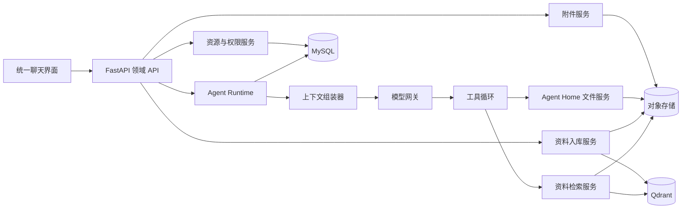
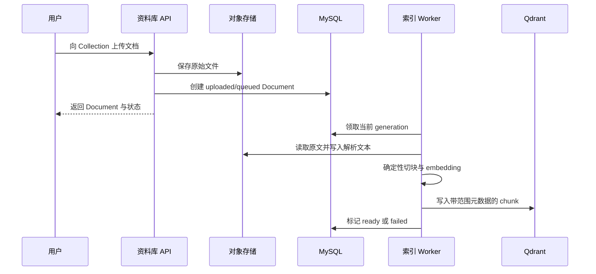

# Auto Reign 通用 Agent 聊天平台设计

## 文档状态

- 日期：2026-07-13
- 状态：已实施；运行事实以 `README.md`、`docs/workbench-architecture.md` 和 `docs/knowledge-data-flow.md` 为准
- 范围：将当前面试学习工作台重构为通用 Agent 聊天平台
- 数据兼容：不兼容旧表、旧文件协议和旧 Prompt 分支；用户已显式执行 `./reset-data.sh --yes`

本文记录本轮设计中已经确认的长期边界。目标产品已从“本地优先、单用户的面试学习工作台”调整为“本地优先、多账号严格隔离的通用 Agent 聊天平台”。实现已经完成，运行事实以仓库中的权威产品、架构和数据流文档为准；本文保留设计决策和取舍，不替代这些文档。

## 背景

当前 Auto Reign 把普通聊天、模拟面试和学习记录实现为三套独立流程：不同的页面、API、会话类型、状态机、Prompt、持久化策略和展示组件。实际上，面试、学习和普通问答的核心差异主要来自 Agent 指令、用户当前意图以及是否需要使用长期文件或资料库。

新架构不再把“面试”和“学习”建模为平台级应用类型，而是提供一个通用聊天运行时：用户先选择 Agent，再用普通自然语言表达“给我抽几题”“学习记录：……”或其他请求。Agent 决定如何交互，Agent Home 中的 `AGENTS.md` 决定如何管理长期文件，Knowledge Collection 为只读参考资料提供 RAG。

设计主要参考以下已经验证的边界：

- 同类开源 Agent 平台实践：Agent Prompt 资源化、配置实时生效、聊天附件、Knowledge Collection、RAG `auto` 路由、代码执行 Workspace、初始化资源和账号 bootstrap。
- 文件化 Agent 平台实践：以文件为长期记忆权威、以根指令文件导航文件系统、由 LLM 决定工具调用、由确定性代码执行受控变更。
- Auto Reign 当前仓库：FastAPI、Next.js、MySQL、Qdrant、SSE、显式破坏性重置和用户隔离约束。

## 外部实践的参考与取舍

采用已验证的通用产品语义：

- Agent 配置不是会话快照，修改后对已有会话的下一轮实时生效。
- 会话首轮选择 Agent 后锁定 Agent 身份，但模型可以在后续轮次切换。
- MySQL 是聊天请求和回复的业务权威；Redis 即使存在也只承担临时协调。
- Knowledge 在有效范围较小时直接提供解析原文，范围较大时使用向量检索。
- 首个管理员采用固定 `admin` 加一次性 bootstrap，而不是“第一个注册者成为管理员”。

Auto Reign 的简化与新增：

- 不引入当前产品不需要的 CRD、Team/Bot/Ghost、Task/Subtask、通用 namespace 或 status 子对象。
- 首期不引入 Celery、Redis、Elasticsearch 或独立检索 Agent。
- 新增 Agent Home：以对象存储文件和根 `AGENTS.md` 支持逐用户隔离的长期自我演进。
- 保持 Agent Home 与未来 Git/POSIX 代码 Workspace 为两种不同存储语义。

## 目标

本次重构必须实现：

1. 只保留一套通用聊天运行时和统一会话历史。
2. 聊天框支持选择 Agent、切换模型和上传附件。
3. 管理员可创建所有用户可见的全局 Agent；普通用户可创建仅自己可见的私有 Agent。
4. Agent 至少支持配置名称、`system_prompt`、默认模型、一个可选 Agent Home 和零个或多个 Knowledge Collection 范围。
5. Agent Home 使用对象存储保存可持续演进的文件，根 `AGENTS.md` 是目录导航和文件管理规则的权威来源。
6. Knowledge Collection 下管理多个 Knowledge Document；文档解析、切块、embedding 后进入 Qdrant，供 Agent 按需检索。
7. Agent Home 与 Knowledge Collection 可以同时绑定，但分别通过文件工具和知识检索工具访问，不互相复制或索引。
8. 聊天附件只作为消息上下文，不自动进入 Agent Home 或 Knowledge Collection。
9. Agent 配置更新对已有会话的后续轮次实时生效；Agent 删除后所有已有会话立即停止继续执行。
10. 模型可在会话中途切换；用户覆盖优先于 Agent 默认模型。
11. LLM 不直接写文件或数据库；所有变更由经过校验的应用代码执行。
12. 完全移除面试、学习和旧 Workspace RAG 的运行时硬编码。

## 非目标

首期不包含：

- 面试轮次、追问、结束报告或学习卡片的专用平台状态机。
- `chat | interview | learning` 会话类型。
- Agent 之间切换同一会话；切换 Agent 必须创建新会话。
- 将聊天附件直接“加入资料库”的快捷操作。
- Agent Home 的向量索引或 Workspace RAG。
- query rewriting、独立 Retrieval Agent、MultiQuery、HyDE 或 LLM rerank。
- 生成式 RAG 摘要作为检索结果。
- Redis、Elasticsearch、Celery 或独立消息队列。
- 多 FastAPI 实例之间的流式恢复与跨进程取消。
- 代码执行模式的实际实现；只预留与 Agent Home 解耦的 Workspace 类型和引用位置。
- 公开用户名密码注册。
- 旧数据迁移、双读、双写或旧 Prompt 回退。
- 其他平台的 CRD、Team/Bot/Ghost、Task/Subtask 等资源和执行模型。

## 总体架构



各层职责如下：

- MySQL：账号、资源定义、会话、消息、附件元数据、Knowledge Document 状态和可审计业务状态的权威来源。
- 对象存储：Agent Home 文件、聊天附件、Knowledge Document 原文及解析文本的权威来源。
- Qdrant：Knowledge Document 的可重建检索投影，不保存业务权威数据。
- Agent Runtime：每轮解析最新 Agent 配置、组装上下文、调用模型并运行工具循环。
- 领域服务：校验权限、资源引用、路径、ETag、状态机和生命周期；不把这些职责交给 Prompt。
- 结构化日志：记录请求标识、资源标识、耗时和错误，不默认记录聊天正文或完整模型请求。

## 核心概念

### Agent

Agent 是用户在聊天前选择的行为配置。它定义：

- 如何理解用户意图；
- 如何交互和回答；
- 何时调用 Agent Home 文件工具；
- 何时查询 Knowledge Collection；
- 默认使用哪个模型。

面试、学习或客服不再是平台内置类型，而是 Agent Prompt 和用户输入的组合。

### Workspace

Workspace 是独立资源，首期定义三种类型：

- `agent_home`：Agent 的长期文件化中台，本次实现。
- `git_repository`：未来代码模式使用的 Git 工作区，本次只保留类型。
- `local_directory`：未来本地设备或 Executor 目录，本次只保留类型。

产品界面统一显示“智能体工作区”。Agent 通过 `home_workspace_id` 引用一个可选的 `agent_home`。未来代码会话通过独立的 `execution_workspace_id` 引用 `git_repository` 或 `local_directory`，不能把代码目录和 Agent Home 混成一个语义。

### Agent Home

Agent Home 是可写、可演进的长期文件权威源。根文件 `AGENTS.md` 说明目录结构、阅读顺序、文件职责、命名方式、写入条件和合并策略。普通文件保存个人事实、学习记录、练习证据和 Agent 积累的经验。

Agent Home 不进入 Qdrant。模型通过 `list_files`、`read_file`、`create_file` 和 `write_file` 等精确文件工具访问。

### Knowledge Collection

Knowledge Collection 是只读参考资料集合。一个 Collection 包含多个 Knowledge Document。Agent 可以绑定：

- 整个 Collection；此后新增并成功索引的文档自动进入范围。
- Collection 下明确选择的一组 Document；只有这些 Document 可被检索。

Knowledge Collection 的内容由用户或管理员在资料库管理页显式上传，不由聊天附件隐式创建。

### Conversation、Message 与 Attachment

- Conversation 固定引用一个 Agent，首条消息后不可更换。
- Message 保存用户输入、Assistant 完整或部分回复及执行状态。
- Attachment 属于一条用户消息；发送前可以是未绑定草稿，发送后与消息固定关联。
- 会话不保存 Agent Prompt、Workspace 文件或 Knowledge Document 的副本。

## 资源模型

### 通用资源表

普通可见资源统一存入 `resources`：

```text
resources
├── id                 UUID
├── user_id            0 表示全局；正整数表示私有资源所有者
├── resource_type      agent | workspace | knowledge_collection
├── name
├── config_json
├── is_active
├── deleted_at
├── created_at
└── updated_at
```

约束：

- 同一 `user_id + resource_type` 下名称唯一。
- `user_id=0` 是全局资源 owner sentinel，不对应 `users` 表中的可登录账号，也不声明为指向用户表的外键；固定管理员是拥有正常正整数 ID 的账号。
- `user_id=0` 的资源只有管理员可以创建、修改和删除。
- 私有资源只对所有者可见。
- 删除使用 tombstone，保留历史引用，但被删除资源不再可执行。
- 表结构不引入 CRD envelope、namespace、status 子对象或通用资源成员表。

底层共用 `resources` 不等于对外提供万能 CRUD API。后端按 `/agents`、`/workspaces` 和 `/knowledge-collections` 暴露类型明确的领域 API，各领域 schema 和 service 负责约束自己的 `config_json`。

### Agent 配置

Agent 的 `config_json` 只包含当前需要的字段：

```json
{
  "system_prompt": "...",
  "default_model": {
    "provider": "...",
    "model": "..."
  },
  "home_workspace_id": "workspace-uuid-or-null",
  "knowledge_scopes": [
    {
      "collection_id": "collection-uuid",
      "document_ids": null
    },
    {
      "collection_id": "collection-uuid",
      "document_ids": ["document-uuid-1", "document-uuid-2"]
    }
  ]
}
```

语义：

- `default_model` 可为空，表示使用系统默认模型。
- `home_workspace_id` 可为空。
- `document_ids=null` 表示整个 Collection。
- `document_ids` 为非空数组时表示精确 Document 子集；空数组无意义并拒绝保存。
- Agent 引用直接保存在配置中，不创建 Agent-Workspace 或 Agent-Knowledge 绑定表。

引用权限：

- 全局 Agent 只能引用全局 Workspace 和全局 Knowledge Collection。
- 私有 Agent 可以引用当前用户自己的私有资源或全局资源。
- 保存 Agent 前必须一次性校验所有引用；不能保存部分有效配置。
- 由于 JSON 中的引用没有数据库外键，应用层必须在同一事务中校验目标类型、可见性、active/tombstone 状态以及 Document 与 Collection 的归属；删除资源时也由应用层检查活动 Agent 的反向依赖。

### Workspace 配置

Workspace 的 `config_json` 至少包含：

```json
{
  "workspace_type": "agent_home",
  "initial_agents_md": "..."
}
```

对于 `agent_home`：

- `initial_agents_md` 只用于创建尚不存在的用户实例。
- 已经存在的 `AGENTS.md` 永远不被模板更新覆盖。
- 管理员修改全局 Workspace 模板，只影响之后首次初始化该 Workspace 的用户。

未来类型可以添加 Git URL、分支、设备或 Executor 配置，但不得改变 Agent Home 的对象存储语义。

### Knowledge Collection 配置

Collection 的 `config_json` 保存检索策略配置，例如 splitter、embedding 配置引用、检索模式、`top_k` 和 score threshold。首期 UI 可以使用平台默认值，不要求普通用户理解这些参数；它们仍是 Collection 配置而不是 Agent Prompt。

### 领域表

除 `resources` 外，保留明确的领域表：

```text
users
knowledge_documents
conversations
messages
attachments
```

不创建 Workspace 文件表、Workspace 实例表、Agent 绑定表或独立工具执行表。

#### users

除账号、密码哈希、角色、启停状态和 `token_version` 外，`users` 为固定 `admin` 保存两个 bootstrap 字段：

- `seed_initialized_at`：非空表示 create-only 资源已经在同一事务内完成初始化。
- `credential_bootstrap_status`：`pending | completed`；只允许从 `pending` 单向变为 `completed`。

普通用户的这两个字段为空。固定 `admin` 是正常正整数 ID 的账号，其记录不能物理删除；停用账号也不能清除上述标记或触发资源重新导入。

#### knowledge_documents

核心字段：

- `id`
- `user_id`
- `collection_id`
- `name`
- `source_object_key`
- `parsed_object_key`
- `mime_type`
- `size_bytes`
- `content_hash`
- `status`
- `index_generation`
- `error_code`
- `error_message`
- `is_active`
- `created_at`
- `updated_at`
- `indexed_at`

`knowledge_documents.user_id` 复制其 Collection 的 owner 语义：全局资料使用 sentinel `0`，私有资料使用实际所有者 ID；服务必须保证二者一致。这个字段同样不能被解释为“全局资料属于可登录 user 0”。

#### conversations

核心字段：

- `id`
- `user_id`
- `agent_id`
- `title`
- `status`
- `model_override_json`
- `created_at`
- `updated_at`
- `deleted_at`

Conversation 只保存 Agent 身份，不保存 Agent 配置快照。`model_override_json` 是用户在该会话中明确选择的临时覆盖。`status` 使用 `idle | generating`，并作为后端并发门闩；同一 Conversation 同时只能有一个活动生成。

#### messages

核心字段：

- `id`
- `user_id`
- `conversation_id`
- `sequence`
- `role`
- `status`
- `content`
- `provider`
- `model`
- `metadata_json`
- `created_at`
- `updated_at`

`sequence` 是同一会话内的单调顺序。Assistant 状态使用 `pending | streaming | completed | failed`。实际 provider/model 记录在 Assistant 消息上。

`metadata_json` 只保存必要审计元信息，例如 `agent_config_updated_at`、规范化配置的 `agent_config_hash`、Prompt bundle version、Workspace/Document 引用、工具名称和状态、RAG 来源、Token、耗时、错误码和重试来源。不得把完整 Agent 配置、附件、文件正文或全部 RAG chunk 再复制一遍。

#### attachments

核心字段：

- `id`
- `user_id`
- `message_id`，发送前为空
- `original_filename`
- `object_key`
- `parsed_object_key`
- `mime_type`
- `size_bytes`
- `content_hash`
- `created_at`

附件只关联用户消息，不与 Knowledge Document 复用生命周期。

## 可见性与生命周期

### Agent 配置实时生效

采用实时配置语义：

- Conversation 固定 `agent_id`。
- 每个新轮次都读取该 Agent 最新的 `system_prompt`、默认模型、Agent Home 和 Knowledge 范围。
- 管理员修改全局 Agent 后，所有用户已有会话的下一轮立即使用新配置。
- 已经开始的生成继续使用本轮启动时解析出的配置；不会在流式处理中途切换。
- Message 上记录本轮 Agent 的 `updated_at` 和规范化配置哈希，仅用于审计，不复制配置快照，也不作为下一轮输入配置。

### Agent 删除

Agent 删除后：

- 从新会话选择器隐藏。
- 已有历史仍然可以查看。
- 已有会话输入框禁用。
- 后端任何新发送请求返回 `agent_unavailable`。
- 不因 soft tombstone 继续执行，也不级联删除 Conversation、Message、Attachment、Workspace 或 Knowledge Document。

### Workspace 与 Collection 删除

- Workspace 或 Collection 被活动 Agent 引用时拒绝删除或停用，返回 `resource_in_use`；用户必须先解除 Agent 引用。
- 删除资源定义使用 tombstone。
- Workspace 文件或 Knowledge 原文的实际清理必须由显式用户管理动作触发，不能在普通启动、迁移或 Agent 删除时自动发生。
- Knowledge Document 被活动 Agent 的 `document_ids` 精确引用时同样拒绝删除或停用；整库绑定不构成对单个 Document 的删除阻塞。
- 允许删除的 Knowledge Document 先立即从检索范围隔离，再清理 Qdrant point 和对象；清理失败保留可重试状态。删除动作不静默改写 Agent 配置，也不会产生悬空的精确引用。

### 多 Agent 共享 Workspace

多个 Agent 可以引用同一个 Workspace 定义。对同一用户，它们读取和写入同一 Agent Home；不同用户永远使用不同实例。

## 对象存储与目录协议

对象存储通过 `ObjectStore` 接口隔离。开发环境可以选择本地实现，生产选择 S3/阿里云 OSS 实现；一次部署只启用一个实现，不双读或双写。

### Agent Home

Agent Home 的物理身份是：

```text
(workspace_id, effective_user_id)
```

对象 Key：

```text
users/{effective_user_id}/workspaces/{workspace_id}/AGENTS.md
users/{effective_user_id}/workspaces/{workspace_id}/...
```

规则：

- 路径中不使用 Agent 名称，重命名 Agent 不移动文件。
- 全局 Agent 和全局 Workspace 仍按当前实际用户创建隔离实例。
- 多个 Agent 引用同一 Workspace 时，同一用户共享这组 Key。
- 所有路径先规范化，再验证仍位于对应用户和 Workspace 前缀下。
- 文件写入使用 ETag/条件请求，禁止静默覆盖并发更新。

### 聊天附件

```text
users/{user_id}/attachments/{attachment_id}/{safe_filename}
```

### Knowledge Document

```text
users/{owner_user_id}/knowledge/{collection_id}/{document_id}/source
users/{owner_user_id}/knowledge/{collection_id}/{document_id}/parsed/{index_generation}
```

全局 Collection 使用 `owner_user_id=0`。Qdrant payload 必须携带 Collection、Document、所有者、`index_generation`、内容哈希、chunk 位置和来源信息，检索时由后端强制加范围过滤。

### 根 AGENTS.md

`AGENTS.md` 是 Agent Home 内的工作规则权威源，典型内容包括：

- 推荐阅读顺序；
- 目录和文件职责；
- 用户原文保存规则；
- 新内容追加、合并或新建文件的条件；
- 长期记忆与临时对话的边界；
- 何时更新 `AGENTS.md` 自身。

根 `AGENTS.md` 是每个已初始化 Agent Home 的必需控制文件，用户管理 API 和 LLM 工具都不能删除它。运行时仅在该对象从未存在时，用 `If-None-Match: *` 等价的条件创建写入模板；因此对象是否存在就是实例初始化事实，无需额外 Workspace 实例表。用户之后可以在 ETag 保护下编辑它，但模板更新不能覆盖它。

它可以被用户或受控 Agent 文件工具更新，但不能：

- 扩大用户、Workspace 或对象存储权限；
- 覆盖平台 Prompt；
- 改变工具 Schema；
- 取得数据库或对象存储凭据；
- 要求应用绕过 ETag、大小限制或安全校验。

其他 Workspace 文件是普通来源材料，不具有指令优先级。

## 未来代码 Workspace 边界

未来代码能力边界：

- 活跃代码目录使用 Git + POSIX 文件系统 + Executor。
- Agent Home 继续保存长期偏好、经验、说明和自我演进文件。
- `execution_workspace_id` 与 `home_workspace_id` 分开解析。
- OSS 可以保存上传包、生成物和运行归档，但不是活跃 Git 工作树。

本次不实现 Git clone、Executor、终端、沙箱或代码归档，只确保资源类型和引用语义不阻塞未来扩展。

## 账号与管理员 bootstrap

首个管理员安全模型：

1. 空库初始化固定用户名 `admin`。
2. 密码字段写入随机且不可用于登录的哈希，不提供默认密码。
3. 只在固定 `admin.credential_bootstrap_status=pending` 时开放一次性密码设置流程。
4. 数据库唯一约束和事务保证并发初始化只产生一个管理员。
5. 完成设置后把状态单向更新为 `completed`，普通登录流程接管。

账号规则：

- 不提供公开用户名密码注册页或注册 API。
- 管理员通过类型明确的用户管理 API 和后台页面创建普通用户，并显式设置符合密码策略的初始密码。
- 首期用户管理至少支持列表、创建普通用户、启用/停用和重置密码；重置或停用必须递增 `token_version`，使已有 Token 失效。
- 未来 OIDC 可以 JIT 创建普通用户，但不能自动授予管理员。
- 用户禁用或 token version 更新后，现有 Token 失效。

## 初始化资源

初始化采用 create-only 语义，但不采用 CRD：

```text
backend/init_data/
├── agents.yaml
└── workspaces.yaml
```

初始化是空库 bootstrap 时的 create-only 导入：

- 固定 `admin` 和预置资源在同一个数据库事务中创建，并设置 `admin.seed_initialized_at`；此时 `admin.credential_bootstrap_status=pending`。
- `admin.seed_initialized_at` 已存在时不再重放 YAML；因此资源重命名后不会按旧名称再建，删除后也不会复活。管理员完成一次性密码设置后，凭据状态永久变为 `completed`。
- 如果进程在事务完成前中断，整个事务回滚，下次启动可以安全重试。
- 重启不覆盖管理员或用户修改。
- tombstone 也视为已经存在，删除的预置 Agent 不会在重启后复活。
- 模板更新不覆盖已初始化 Agent Home。
- 只有显式全量重置会删除固定 `admin` 记录，从而清除两个 bootstrap 字段；下一次空库初始化为资源生成新的 UUID。

空库预置一个全局“成长助手”：

- 普通聊天、学习记录和模拟面试都由同一个 Agent 根据用户自然语言处理。
- 它绑定一个全局 Agent Home 定义。
- 它的 `system_prompt` 和初始 `AGENTS.md` 是可编辑初始化数据，不是隐藏运行时回退。
- 不预置“面试 Agent”和“学习 Agent”两套资源。

## 前端信息架构

### 统一入口

侧边栏只保留一个“新聊天”入口。删除“新面试”“新学习”和专用复盘入口。所有 Conversation 使用统一路由：

```text
/chat?session={conversation_id}
```

### 输入框布局

统一输入区布局：

```text
左下角：附件按钮、Agent 选择器
右下角：模型选择器、发送按钮
```

Agent 选择器：

- 仅在新会话第一条消息发送前显示。
- 分为“系统智能体”和“我的智能体”。
- 支持搜索。
- 底部提供创建和管理入口。
- 首条消息发送后隐藏；会话顶部只读展示当前 Agent。

模型选择器：

- 提供“跟随智能体默认模型（当前：…）”。
- 用户可以在首条消息前选择覆盖模型。
- 已有会话在没有生成任务时可以继续切换。
- 正在生成时暂时禁用，生成结束后恢复。
- Assistant 消息可以展示实际使用模型。

附件：

- 发送前展示草稿列表并允许移除。
- 消息发送后提供预览和下载。
- 首期不提供“加入资料库”。

### Agent 管理

Agent 编辑器字段：

- 名称；
- `system_prompt`；
- 可选默认模型；
- Agent Home：不使用、选择已有或创建新的；
- 创建 Agent Home 时填写 Workspace 名称和初始 `AGENTS.md`；
- Knowledge 范围：选择一个或多个 Collection，并选择整库或 Document 子集。

管理员入口创建全局 Agent，个人入口创建私有 Agent；不在表单里提供可见性切换开关。

### 用户管理

管理员后台提供 `/admin/users` 页面及对应领域 API，用于列出账号、创建普通用户、启用/停用和重置密码。首期不提供普通用户自助注册或管理员角色授予；密码正文不得进入日志或审计 metadata。

### Workspace 与资料库管理

Workspace 页面按显式 Workspace 资源浏览真实文件树和 Markdown 内容，不再假设每个用户只有一个固定目录，也不展示 Qdrant 索引状态。

资料库页面展示：

```text
Collection 列表
  → Document 列表
      → 上传、解析/索引状态、预览、删除、重新索引
```

Agent Home 文件和 Knowledge Document 不能混在同一个 artifact 列表中。

### 历史与不可用状态

- 历史列表不再按 Conversation kind 分组或跳转。
- Agent 已删除时历史消息仍可查看，输入框显示 Agent 不可用并禁用发送。
- loading、empty、error、streaming 和 i18n 状态必须完整。

## Agent Runtime

### 每轮解析顺序

每次新消息执行：

1. 从认证上下文取得 `user_id`，客户端不能传入或覆盖。
2. 开启短 MySQL 事务；已有会话锁定 Conversation 并校验归属与 `status=idle`，首条消息读取新会话选择器提交的 `agent_id`。
3. 在事务中读取最新 Agent 及其引用的 Workspace/Collection 定义并校验当前用户可见；若 Agent 已删除或不可用，返回 `agent_unavailable`，否则固定本轮规范化配置、资源引用版本与哈希。
4. 在事务中解析模型：已有 Conversation 覆盖或首条消息的用户覆盖 > 最新 Agent 默认 > 系统默认，并校验模型可用。
5. 校验附件后创建或更新 Conversation、保存用户 Message、绑定 Attachment、创建 pending Assistant，然后提交事务。
6. 解析已固定的本轮 Agent Home，并以当前用户确定物理实例；根 `AGENTS.md` 不存在时用本轮 Workspace 模板进行一次性条件创建，再读取实际文件。
7. 解析已固定的本轮 Collection/Document 范围；实际检索时仍只接受当前 `ready + active + current generation` 的 Document。
8. 读取有界的已完成会话消息，以及绑定到这些用户消息的附件；当前用户消息和当前附件必须作为一个完整输入单元保留。
9. 组装平台 Prompt、Agent Prompt、`AGENTS.md`、动态上下文和工具 Schema。
10. 进入主 LLM 工具循环，并持续更新已经持久化的 Assistant 状态。

### 指令优先级

```text
平台行为协议与安全不变量
  > Agent system_prompt
  > Agent Home/AGENTS.md
  > 用户消息与已完成历史
  > 附件、Knowledge 内容和普通 Workspace 文件
```

附件、Knowledge 内容和普通 Workspace 文件都是不可信来源材料。它们不能要求模型改变角色、调用越权工具、泄露 Secret 或覆盖持久化协议。

### 四种合法组合

| Agent 配置 | 运行时能力 |
|---|---|
| 无 Agent Home、无 Collection | 会话历史（含窗口内消息附件） |
| 有 Agent Home、无 Collection | 会话历史与附件 + 精确文件工具 |
| 无 Agent Home、有 Collection | 会话历史与附件 + Knowledge 工具 |
| 同时具有两者 | 两组工具同时可用，由主 LLM 按来源语义选择 |

Agent Home 适合可写的个人状态和长期演进；Knowledge Collection 适合只读参考资料。二者同时存在是正常场景，不禁止配置。

### 模型选择

模型优先级固定为：

```text
conversation.model_override
  > current_agent.default_model
  > system_default_model
```

规则：

- 用户中途切换后，从下一条消息开始使用新模型。
- 选择“跟随智能体默认模型”会清除会话覆盖。
- Agent 默认模型更新时，没有覆盖的已有会话下一轮自动跟随。
- Provider 或模型不可用时明确失败，不静默降级。
- ProviderName 使用后端返回的动态字符串，前端不维护封闭枚举。

## Agent Home 文件工具

首期给模型暴露：

- `list_files`
- `read_file`
- `create_file`
- `write_file`

不向 LLM 暴露删除工具。用户需要删除文件时使用显式管理界面或 API。

显式管理界面或 API 只能删除普通文件，根 `AGENTS.md` 始终拒绝删除。这样“缺失时初始化”不会把用户主动删除的控制文件重新创建。

写入协议：

```text
LLM 生成结构化工具参数
→ 校验用户、Workspace 和规范路径
→ 校验操作类型、大小和 expected_etag
→ 对象存储条件写入
→ 返回新的 ETag 和文件元数据
→ 记录工具审计元信息
```

成功的文件工具调用是独立原子操作。之后即使模型回答失败，也不回滚已经成功写入的文件。ETag 冲突返回 `workspace_conflict`，模型可以重新读取后再提交。

## Knowledge 入库与检索

### 入库流程



首期不引入 Celery。`KnowledgeIndexWorker` 运行在单个 FastAPI 部署中，状态保存在 `knowledge_documents`，而不是内存 Job 队列或额外 Job 表。

状态机：

```text
uploaded → queued → processing → ready
                         ↘ failed
```

规则：

- 每次重新索引递增 `index_generation`。
- 解析文本写入 generation 专属对象；只有当前 generation 成功切换为 `ready` 时，事务才把 `parsed_object_key` 指向该对象，迟到任务不能覆盖当前解析原文。
- Qdrant point ID 包含 `document_id + index_generation + chunk 序号`，不同 generation 不能互相覆盖。
- Worker 写入的每个 payload 都携带领取时的 generation；只有该 generation 仍是 Document 当前值时，才能在 MySQL 事务中把状态切换为 `ready`。
- 检索同时过滤 Document ID 和 MySQL 当前 `index_generation`，因此迟到 Worker 写入的旧 point 永远不可见。
- 新 generation 成功切换后，异步尽力清理该 Document 的旧解析对象和 Qdrant point；迟到旧任务或清理失败留下的对象/point 只是可回收垃圾，不能参与直注或检索。
- 启动时恢复 `queued` 和超时的 `processing`。
- `failed` 不无限自动重试，由用户显式重新索引。
- Qdrant 不可用不影响原始文件和解析文本。
- 只有 `ready + active` Document 可以被检索。

### 检索调用

主 LLM 根据用户问题决定是否调用 `search_knowledge`。首期不在主调用前增加独立检索 LLM。

`search_knowledge` 使用 `auto` 路由：

1. 根据 Agent 已绑定的 Collection/Document 范围做权限过滤。
2. 如果有效文档范围的完整解析文本能够放入当前可用上下文预算，直接返回这些来源原文。
3. 否则使用主 LLM 提供的 query 在 Qdrant 检索来源派生 chunk。
4. 返回内容、Collection、Document、文件名、chunk 位置、score 和引用标识。

RAG 返回的是原文确定性或语义边界切分得到的来源片段，不是生成式摘要。语义 splitter 可以使用 embedding 判断边界，但不得改写来源内容。

首期不启用：

- query rewriting；
- 独立 Retrieval Agent；
- LLM rerank；
- 生成式摘要检索；
- Agent Home 文件索引。

### Workspace 与 Knowledge 同时使用

平台 Prompt 明确两类来源：

- 用户个人状态、已沉淀记录、可变长期记忆：优先 Agent Home 文件工具。
- 外部规范、手册、制度、教材和只读参考：优先 Knowledge 工具。

主 LLM 可以在一轮中先读取 Agent Home，再检索 Knowledge，或反过来；平台不做关键词硬路由。权限、范围和预算始终由确定性代码控制。

## 聊天附件

聊天附件采用简单、显式的上传语义：

1. 同步验证文件名、MIME 和大小。
2. 在持久化前完成可支持格式的文本提取；图片保留视觉输入信息。
3. 成功后创建未绑定 Attachment。
4. 用户发送消息时，在同一事务内把 Attachment 绑定到用户 Message。
5. 解析失败时上传失败，不创建可发送 Attachment。

附件发送后：

- 可以预览和下载。
- 不能单独从消息中删除。
- 不复制到 Agent Home。
- 不创建 Knowledge Document。
- 不进行 embedding 或 Qdrant 入库。
- 解析文本作为所属用户消息的不可信上下文使用；只要该消息仍在本轮历史窗口中，后续轮次可以继续引用它。
- 长会话按 Token 预算一起裁剪旧消息及其附件，不保留脱离原消息的附件正文，也不为此调用压缩 LLM。

## Prompt 所有权

### 可配置业务 Prompt

以下内容必须进入 Agent `system_prompt` 或 Agent Home `AGENTS.md`：

- 如何出题、点评、追问和结束模拟面试；
- 如何理解“学习记录”；
- 学习原文是否沉淀；
- 薄弱点、高频题和练习证据写到哪里；
- 文件命名、目录职责和合并规则；
- Agent 的角色、语气和回答格式。

### 平台 Prompt

平台行为协议不进入数据库或管理页面，而是随代码版本管理的模块化 Markdown 资产：

```text
backend/app/prompts/platform/
├── core.md
├── attachments.md
├── agent_home.md
├── knowledge_base.md
└── context_budget.md
```

首期只加载当前轮实际需要的模块。`context_budget.md` 只描述确定性的 Token 预算和裁剪结果，不调用压缩 LLM；如果未来启用生成式压缩，必须另行设计其来源保真与失败恢复。平台 Prompt 负责：

- 指令优先级；
- 不可信来源包装；
- Agent Home 与 Knowledge 的角色说明；
- 工具和引用使用协议；
- 上下文预算与错误处理指导。

真正的用户隔离、路径安全、权限、调用次数和状态机由代码执行，不能依赖 Prompt。

### 工具协议

工具名称、描述和参数 Schema 属于代码接口，通过 Pydantic/模型工具协议生成，不允许 Agent Prompt 修改。

### 预置 Prompt

“成长助手”的 Prompt 和 Workspace 模板来自 create-only 初始化 YAML。导入后成为普通可编辑资源；运行时不存在随包 Prompt 回退。

## 当前业务硬编码的移除

实施后删除当前业务 Prompt：

- `answer_feedback.md`
- `learning_note_summary.md`
- `question_generation.md`
- `report_generation.md`
- 面试学习专用 Prompt catalog 和 ModelService 方法

同时删除或替换：

- `InterviewService` 的创建、答题、追问、下一题、结束和报告状态机；
- `InterviewArtifactService`；
- `WorkspaceContentService` 中的学习和真实面试专用流程；
- 面试学习专用 renderer、schema 和 API；
- 关键词/正则意图识别和固定轮数推断；
- 固定 `workspace_paths`、artifact kind 和旧 `default_manifest.md` 同步逻辑；
- Workspace Qdrant、面试 mode query planner 和简历/JD 自动分类；
- `/interview`、`/learn`、专用复盘页及对应组件、i18n 和测试；
- 前端 `ConversationKind` 和分路由逻辑。

平台运行时代码中不得再根据“面试”或“学习”进入特殊分支。相关文字只能存在于用户创建的 Agent、预置 Agent 配置、用户文件或产品说明中。

## LLM 与确定性代码边界

| 环节 | 主聊天 LLM | 其他模型 | 确定性代码 |
|---|---|---|---|
| 理解用户意图和生成回答 | 是 | 否 | 组装输入 |
| 决定是否读写 Agent Home | 是 | 否 | 权限与工具执行 |
| 生成文件内容和工具参数 | 是 | 否 | 路径、ETag、大小校验 |
| 决定是否检索 Knowledge | 是 | 否 | 作用域过滤与预算 |
| 生成检索 query | 是 | 否 | Qdrant 查询 |
| query rewriting/rerank | 否 | 首期不启用 | 否 |
| 文档解析和切块 | 否 | 否 | 是 |
| embedding | 否 | Embedding 模型 | 调度和写索引 |
| Agent/模型/资源解析 | 否 | 否 | 是 |
| 会话标题 | 否 | 否 | 首条消息确定性截取 |
| 长会话压缩 | 否 | 首期不启用 | Token 预算裁剪 |
| 文件或数据库写入 | 只提出结构化操作 | 否 | 是 |

所有已经接受的原始用户消息完整保存；`completed` Assistant 保存最终完整内容。可捕获失败在标记 `failed` 前立即保存当前缓冲区，进程被强制终止时则保证保存截至最近 checkpoint 的部分内容，最后一个 checkpoint 之后尚未落库的流式字符可能丢失。模型可见上下文的裁剪不修改已经持久化的历史数据。

## 消息一致性与流式失败

### 写入顺序

每轮在调用模型前，用一个 MySQL 事务完成：

```text
已有 Conversation 执行 SELECT ... FOR UPDATE 并要求 status=idle
→ 在锁内解析并校验 Agent、当前模型覆盖和附件
→ 创建 Conversation（仅首轮，直接置为 generating）
→ 已有 Conversation 标记为 generating
→ 为用户与 pending Assistant 分配连续的 message sequence
→ 保存用户 Message
→ 绑定 Attachment
→ 创建 pending Assistant Message
→ 提交
→ 开始模型与工具循环
```

如果已有会话处于 `generating`，后端返回 `generation_in_progress`，不能并行接受第二条用户消息、重新生成或模型覆盖修改。这个约束由数据库事务和行锁保证，不能只依赖前端禁用按钮。

流式过程中：

- Assistant 进入 `streaming`。
- 按不高于每秒一次的频率把累计文本 checkpoint 到 MySQL。
- 完成后写入最终文本、Token、耗时、引用和 `completed`，并把 Conversation 恢复为 `idle`。
- Provider 或工具循环异常可被捕获时，先立即保存当前缓冲区再标记 `failed`，并把 Conversation 恢复为 `idle`。
- `failed` Assistant 可以展示，但不进入以后模型历史。
- 用户消息永远保留。

服务启动时把遗留的 `pending/streaming` Message 状态改为 `failed`，并在 metadata 的 `error_code` 记录 `generation_interrupted`，同时把对应 Conversation 恢复为 `idle`；不自动重放，避免重复执行文件工具。用户点击“重新生成”会创建新的 Assistant attempt，并在 metadata 中记录 `retry_of_message_id`。

### 工具结果

- 文件工具错误作为结构化工具结果返回，主 LLM 可以修正后重试。
- 已成功的外部副作用不因之后的生成失败而回滚。
- metadata 保存工具名称、参数摘要、状态、ETag、来源引用和错误码，不复制大段工具输出。

## 错误语义

必须提供稳定错误码：

- `agent_unavailable`：Agent 已删除或停用。
- `resource_reference_invalid`：Agent 配置引用不可见或不存在。
- `resource_in_use`：Workspace、Collection 或精确 Document 仍被活动 Agent 引用。
- `model_unavailable`：覆盖、Agent 默认或系统默认模型不可用。
- `attachment_invalid`：附件格式、大小或解析失败。
- `attachment_not_ready`：附件不能绑定到当前发送。
- `workspace_conflict`：ETag 冲突。
- `workspace_unavailable`：对象存储或 Workspace 初始化失败。
- `knowledge_unavailable`：索引服务或 Qdrant 不可用。
- `knowledge_document_not_ready`：目标 Document 尚未成功索引。
- `context_too_large`：单条消息、附件或直接注入范围超过可处理预算。
- `generation_interrupted`：服务中断了进行中的生成。
- `provider_call_failed`：Provider 调用失败。
- `generation_in_progress`：同一 Conversation 已有活动生成或模型状态变更冲突。

错误不能触发静默模型回退、越权扩大检索范围或自动删除用户数据。

## 可观测性与基础设施

### 请求和回复的权威记录

用户请求和 Assistant 回复以 MySQL Message 为权威记录。默认不再保存一份完整的模型请求副本，因为组装请求会重复包含用户历史、附件、Agent Prompt、`AGENTS.md` 和 RAG 内容。

Assistant metadata 保存足以定位问题的非正文信息：

- `request_id`
- `conversation_id`
- `message_id`
- provider/model 和 Provider request ID
- `agent_config_updated_at`、`agent_config_hash` 与平台 Prompt bundle version
- 使用的 Workspace/Collection/Document 引用
- Token、首 Token 延迟、总耗时
- 工具与检索状态
- 稳定错误码

### 日志

增加结构化 JSON 日志和请求 ID 中间件。默认日志不得包含：

- 用户消息正文；
- Assistant 正文；
- 附件或文件正文；
- RAG chunk；
- API Key、Token 或对象存储凭据。

可以提供显式关闭默认值的本地 LLM 调试日志。开启后必须脱敏、限长，并写到用户明确配置的本地文件；它不是业务权威数据。

### 不引入 Elasticsearch

- Qdrant 已承担首期 Knowledge RAG 索引。
- 聊天审计由 MySQL 承担。
- 首期不部署 Elasticsearch 或 Kibana。
- 未来可以通过 OpenTelemetry Collector 输出到任意观测后端，但应用不能依赖某个 ES 索引才能运行。

### 不引入 Redis

首期部署契约是单 FastAPI 实例，使用：

- MySQL 消息 checkpoint；
- 当前进程 SSE；
- 当前进程取消信号；
- MySQL Document 状态机；
- 对象存储 ETag。

出现下列需求时才引入 Redis：

- 多 FastAPI 实例；
- 页面刷新后需要从任意实例继续接收同一条流；
- 跨进程取消；
- 独立 Knowledge Worker 或 Celery；
- 分布式限流或锁；
- MySQL 流式 checkpoint 压力成为实际瓶颈。

届时 Redis 只能作为可丢失、可重建的协调、缓存、Pub/Sub 和队列层，不能成为 Message 或文件的唯一存储。

## 数据重建与迁移

用户已在本次设计后显式执行：

```sh
./reset-data.sh --yes
```

实施采用新的 Agent 平台 Alembic baseline：

- 不编写旧表到新表的数据迁移。
- 不保留旧表供运行时读取。
- 不转换旧 Workspace 文件或 Qdrant collection。
- 不添加兼容字段或旧 Prompt 分支。
- 检测到任何旧 Alembic revision 或旧业务表时都拒绝启动并要求显式重置；即使旧表为空也不自动 DROP、改名或套用新 baseline。

`./reset-data.sh --yes` 继续显式清理本地 MySQL、Qdrant 和本地运行数据。远端 OSS 不随普通本地重置自动清空；如以后需要远端清理，必须提供独立 purge 命令和二次显式参数。

初始化 Resource 使用新 UUID，避免重置后重新使用旧对象 Key。

## 安全边界

必须由确定性代码保证：

- `user_id` 只来自认证上下文。
- 所有 DB 查询带当前用户或全局可见范围。
- 全局 Agent Home 仍以 `effective_user_id` 物理隔离。
- Object Key 和本地测试路径都不能越过用户/Workspace 前缀。
- Agent 配置不能引用其他用户私有资源。
- Collection/Document 检索必须在服务端添加权限 Filter。
- Agent Prompt、`AGENTS.md`、附件和 Knowledge 内容都不能获得 Secret。
- 工具参数经过 Pydantic 校验。
- 文件写入使用大小限制、ETag 和操作预算。
- 上传内容中的 Prompt injection 只能作为来源文字，不能成为平台指令。
- LLM 没有数据库 Session、对象存储 Client 或 Qdrant Client。

## 测试与验收

### 后端

必须覆盖：

- 新 baseline 在空 MySQL 上创建目标 schema。
- 非空旧 schema 不被自动删除。
- bootstrap 只产生一个 `admin`，`seed_initialized_at` 阻止 seed 重放，随机密码不能登录，凭据状态完成后不可回到 `pending`。
- 管理员创建、停用和重置普通用户，并使旧 Token 失效。
- 全局/私有 Agent、Workspace、Collection 的可见性和引用校验。
- 全局 Agent Home 对不同用户使用不同对象 Key。
- 同一用户多个 Agent 共享同一 Workspace。
- Agent 更新对已有 Conversation 下一轮生效。
- Agent 删除后已有 Conversation 返回 `agent_unavailable`。
- 模型覆盖、清除覆盖和中途切换。
- 首条消息前持久化、同会话并发生成拒绝、流式 checkpoint、Provider 失败和中断恢复。
- 失败 Assistant 不进入模型历史。
- 附件上传、绑定、解析失败、跨用户绑定拒绝和消息后不可单独删除。
- `AGENTS.md` 使用条件创建完成首次初始化、永不被模板覆盖且不能删除。
- 文件路径穿越、ETag 冲突、对象存储失败和无 LLM 删除工具。
- Agent Home 文件不进入 Qdrant。
- Collection 整库/Document 子集过滤。
- 被精确绑定的 Document 拒绝删除，整库绑定允许删除单个 Document。
- `auto` 直接原文与 RAG 两条路由。
- Qdrant 返回来源 chunk，不返回生成摘要。
- `index_generation` 同时隔离 MySQL 状态、解析对象和 Qdrant point，迟到旧任务不可直注或检索，失败可重新索引。
- Qdrant 故障不丢失原文或解析文本。
- Prompt injection 不能改变权限和工具协议。
- 日志不包含正文、附件、RAG chunk 和 Secret。

除明确集成测试外，模型、Embedding、对象存储和 Qdrant 使用确定性 test double。

### 前端

必须覆盖：

- 只有一个“新聊天”入口。
- 新会话 Agent 分组、搜索、选择和创建入口。
- 首条消息后 Agent 锁定并在顶部只读展示。
- Agent 删除后历史可读、输入框禁用。
- “跟随智能体默认模型”和中途切换。
- 附件草稿、移除、发送、预览和下载。
- 不出现“加入资料库”。
- Agent CRUD、Workspace 选择/创建和 Knowledge scope 编辑。
- 管理员用户列表、创建、启停和重置密码。
- Collection/Document 管理、状态、失败和重新索引。
- Workspace 文件树和 Markdown 编辑的 ETag 冲突。
- loading、empty、error、streaming 和中英文文案。
- 统一历史路由，不再存在 interview/learning 分支。

### 仓库检查

实施各阶段及最终提交运行：

```sh
cd backend
uv run pytest -v
uv run ruff check .

cd ../frontend
npm test
npm run build

cd ..
docker compose config
```

### 最终验收条件

1. 当前面试、学习和真实复盘专用运行时已经删除。
2. 平台代码中没有面试/学习业务 Prompt 或特殊会话分支。
3. 通用聊天同时支持 Agent、模型、附件、Agent Home 和 Knowledge。
4. 所有用户与对象存储范围严格隔离。
5. Agent 配置实时生效，删除立即阻断后续轮次。
6. Workspace 文件是 Agent Home 唯一权威，Qdrant 只索引 Knowledge Document。
7. 消息失败和索引失败不丢失已经接受的用户原始数据。
8. 没有 Redis、Elasticsearch、双读、双写或兼容分支。
9. `README.md`、`docs/workbench-architecture.md` 和 `docs/knowledge-data-flow.md` 已更新为新的运行事实。

## 实施分段原则

本设计属于一次平台重构，但实施必须拆成可独立验证的阶段：

1. 新 baseline、账号 bootstrap、资源模型和 create-only 初始化。
2. 统一 Conversation/Message Runtime、Agent/模型选择和旧流程删除。
3. 聊天附件和对象存储接口。
4. Agent Home、`AGENTS.md` 和文件工具。
5. Knowledge Collection、Document 入库、Qdrant 和检索工具。
6. Agent/Workspace/资料库管理界面及文档收口。

实施阶段已经完成，应用和测试验证命令以仓库当前开发工作流为准。后续变更应继续拆成可独立验证的阶段，并同步更新权威文档。
