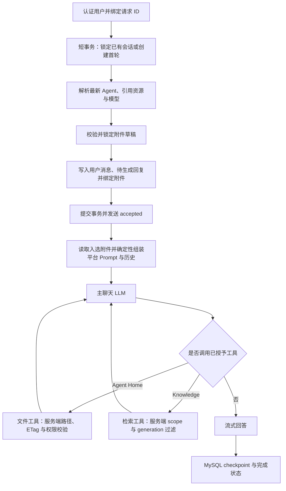

# Auto Reign 通用 Agent 平台架构

本文是 Auto Reign 的长期架构权威。当前可运行方式见[项目说明](../README.md)，Knowledge Document 的入库和检索细节见[Knowledge Collection 数据流](knowledge-data-flow.md)，生产配置与运维边界见[生产部署](production-deployment.md)。

## 产品边界

Auto Reign 是本地优先、多账号严格隔离的通用 Agent 聊天平台。普通问答、模拟面试、学习记录、客服或其他应用都使用同一套 Conversation、Message 和 Runtime；差异来自 Agent 配置与用户自然语言输入，而不是平台级会话类型、专用页面或业务状态机。

Agent 的 `system_prompt` 定义角色、交互方式和业务行为。平台运行时代码不能根据“面试”“学习”等业务名称进入特殊分支，也不保留业务 Prompt fallback。

当前核心能力包括：

- global/private Agent、Workspace 和 Knowledge Collection 的类型化管理；
- 单一 `/chat?session=...` 会话入口、动态模型覆盖和可靠 SSE；
- Message 绑定的聊天附件；
- 可选 Agent Home 文件能力；
- 可选 Knowledge 原文与 RAG 检索；
- fixed `admin` 一次性初始化和普通用户管理。

认证上下文中的 `user_id` 是租户隔离边界。数据库 scope、ObjectStore Key 前缀、Agent Home 实例与 Knowledge filter 都由后端从当前用户派生；客户端不能通过提交 `user_id` 切换数据域。

## 核心资源

| 概念 | 配置或身份 | 生命周期 |
| --- | --- | --- |
| Agent | `system_prompt`、可选 `default_model`、可选 `home_workspace_id`、`knowledge_scopes` | global 或 private；Conversation 可选引用，绑定 Agent 的会话配置每个新轮次实时解析 |
| Workspace | `workspace_type=agent_home`、`initial_agents_md` | 多个 Agent 可共享定义；物理实例按 `(workspace_id, effective_user_id)` 隔离 |
| Knowledge Collection | chunk、overlap、`top_k`、score threshold 等检索策略 | 显式包含 Document；Agent 可绑定整库或精确 Document 子集 |
| Knowledge Document | Collection、owner、对象 Key、状态、内容 hash、`index_generation` | 原文显式上传；解析和 Qdrant 投影可重建 |
| Conversation | `user_id + 可选 agent_id + model_override` | 新聊天默认不绑定 Agent；首轮选择后锁定，纯 LLM 会话不启用 Agent 能力 |
| Message | Conversation 内单调 sequence、角色、正文、生成状态和审计 metadata | User Message 在模型调用前提交；Assistant 支持 checkpoint、失败和 retry |
| Attachment | 一条 User Message 的来源，未绑定时是当前用户草稿 | 草稿可删；发送准备事务成功后绑定并固定，不自动进入 Home 或 Knowledge |

Agent、Workspace 和 Knowledge Collection 共用 `resources` 表中的 owner、名称、active、tombstone 和审计列，但不采用 CRD，也不公开万能 `/resources` CRUD。后端分别提供 Agent、Workspace 和 Knowledge Collection 的领域 schema、service 与 API。

Agent 对 Workspace 和 Knowledge 的引用直接保存在 Agent 配置中，不创建绑定表。平台也不创建 Workspace 文件表、Workspace 实例表、Knowledge Job 表或工具执行表。

## 数据权威与投影

| 存储 | 权威职责 |
| --- | --- |
| MySQL | 用户、typed resource、Knowledge Document 状态、Conversation、Message、Attachment metadata 和绑定关系 |
| ObjectStore | 聊天附件、Agent Home 文件、Knowledge 原文和 generation 专属解析文本 |
| Qdrant | 从 Knowledge 当前解析文本生成、可重建的原文 chunk 向量投影 |

平台共有六张业务表：

- `users`：账号、密码哈希、角色、启停、`token_version` 和 fixed admin bootstrap 状态；
- `resources`：Agent、Workspace、Knowledge Collection 的 typed config、owner、active 和 tombstone；
- `knowledge_documents`：对象引用、处理与清理状态、错误、内容 hash 和当前 `index_generation`；
- `conversations`：固定 Agent、模型覆盖、`idle/generating` 状态和 soft delete；
- `messages`：正文、生成状态、实际 provider/model 和非正文审计 metadata；
- `attachments`：owner、Message 绑定、对象 Key、大小和内容 hash。

Qdrant、stdout 日志和 Assistant audit metadata 都不是正文权威。Qdrant 可以从 ObjectStore 与 MySQL 当前 generation 重建；平台不另外保存包含完整 Prompt、历史、附件、文件或 RAG chunk 的模型请求副本。

## 每轮 Runtime



### 准备事务与 receipt

已有 Conversation 必须锁定并处于 `idle`；首轮校验所选 Agent 后创建 Conversation。应用在同一短事务中：

1. 读取最新 Agent 配置，锁定并校验引用资源与有效 Knowledge Document；
2. 按“会话覆盖 > 最新 Agent 默认 > 系统默认”解析模型；
3. 锁定附件草稿并校验 owner、未绑定状态与确定性顺序；
4. 保存 completed User Message 和 pending Assistant；
5. 把附件绑定 User Message，选取 completed 历史并执行预算裁剪；
6. 提交后发送首个 SSE `accepted`。

`accepted` 只是准备事务已经提交的 receipt，不表示附件对象已经读到、模型已经开始或生成会成功。ObjectStore 只在 receipt 之后读取最终入选窗口中的附件，并校验 Key、大小和 hash。附件损坏、存储故障、Provider/Runtime 失败或连接取消会保留已提交的用户消息与附件绑定，并把 Assistant 尽力标为 `failed`。

已有 Conversation 处于 `generating` 时，后端拒绝并发发送、retry 和模型覆盖修改，返回 `generation_in_progress`。该门闩由数据库行锁和状态保证，不依赖前端按钮。

### Agent 配置与模型

Conversation 只保存 `agent_id`，不保存 Agent 配置快照。每个新轮次都读取 Agent 最新的 `system_prompt`、`default_model`、`home_workspace_id` 和 `knowledge_scopes`；管理员修改 global Agent 后，所有用户已有会话的后续轮次同样实时生效。已经开始的生成继续使用本轮冻结配置，不在流中切换。

模型优先级固定为：

```text
conversation.model_override
  > current_agent.default_model
  > system_default_model
```

- 新会话可在第一条消息前设置覆盖；
- 已有会话只在 `idle` 时修改或清除覆盖；
- 清除覆盖后，下一轮跟随 Agent 最新默认模型；
- 系统默认模型严格取 `DEFAULT_CHAT_PROVIDER` 的第一个已配置模型；
- Provider 或模型不可用时返回 `model_unavailable`，不会静默切换；
- Assistant Message 保存本轮实际 provider 和 model。

### 流式状态与恢复

Assistant 状态为 `pending | streaming | completed | failed`。第一段正文到达后进入 `streaming`，流中按有界频率 checkpoint 累计内容；完成或失败都用独立短事务恢复 Conversation 为 `idle`。服务启动时把遗留 pending/streaming Assistant 标为 `generation_interrupted`，不会自动重放可能包含工具副作用的生成。retry 创建新的 Assistant attempt，并记录 `retry_of_message_id`。

生成审计保存在 Assistant metadata，而不是 stdout：

- Conversation、Message 和安全 request ID；
- 每次真实 Provider 调用的 `call_index`、provider、model、安全 Provider request ID、结构化 token usage、首个正文延迟、duration、status 和 `unavailable_fields`；
- 本轮聚合 token usage、首个可用正文延迟和总 duration；
- 已执行工具的有界、非正文审计。

Provider 不提供的字段保持 `null` 并列入 unavailable，不能通过估算、日志解析或 completion chunk ID 伪造。成功、Provider/Runtime 失败和取消都会尽力保存已经观察到的 metrics；最终合并不能覆盖此前即时保存的 Tool audit。

### Prompt 所有权

当前 system 层级为：

```text
平台行为协议与安全不变量
  > Agent system_prompt
  > 应用从 Agent Home 根路径读取的 AGENTS.md
  > 用户消息、附件、已完成历史与 ToolResult
```

平台 Prompt 位于 `backend/app/prompts/platform/` 并随代码版本管理，负责安全、权限不变量和上下文预算。业务角色、意图解释、语气和回答格式属于 Agent `system_prompt`。预置 Agent/Workspace 只通过 create-only YAML 导入一次，之后作为普通资源管理；运行时没有随包业务 Prompt fallback。

只有应用从 Home 根对象读取并独立注入的 `AGENTS.md` 是受控指令层。通过普通 `read_file` 得到的任何文件内容都仍是不可信数据，不能改变平台 Prompt、工具 schema、权限、路径或用户隔离。

### 共享上下文预算协议

所有 CapabilityProvider 共用一个 `RuntimeTokenCounter` 和原始总预算：

- 文本、消息、工具 schema 和 ToolResult 使用确定性的保守上界；图片每张使用 `IMAGE_INPUT_TOKEN_RESERVE`，不是按 Base64 长度计数；
- 历史按完整 Turn 裁剪，User Message、其全部附件和已完成 Assistant 回复不可拆分；
- 当前 Turn 和其中全部图片必须原子进入上下文，否则准备事务整体回滚；
- 有工具时先预留 `TOOL_RESULT_TOKEN_RESERVE`；每次工具调用都从原始总预算重新计算剩余量；
- CapabilityProvider 在大读取或有副作用写入前预检，Runtime 对完整 ToolResult envelope 最终校验；
- 结果超限时返回有界 `context_too_large`，连最小错误都放不下时终止本轮。

## Agent Home 文件协议

Agent Home 的物理身份是 `(workspace_id, effective_user_id)`，对象 Key 前缀为：

```text
users/{effective_user_id}/workspaces/{workspace_id}/
```

`effective_user_id` 只能来自认证上下文。即使 Agent 或 Workspace 是 global，实际文件仍属于当前登录用户的隔离实例；同一用户的多个 Agent 可以共享 Workspace，不同用户不能共享物理文件。

Agent Home 的保存语义由用户意图触发，而不是由聊天轮次触发：

- 普通聊天、答题和讨论不会自动写入 Agent Home；只有用户明确要求长期保存、记录或更新时，模型才可以使用文件工具；
- 用户明确要求保存时，模型先读取相关文件，再按同主题合并，避免重复创建内容；
- 已有文件只能使用最近一次 `read_file` 返回的 ETag 调用 `write_file`，创建新文件使用 `create_file`；
- 只有文件工具成功返回后，模型才能向用户确认保存完成；未调用工具、工具不可用或工具返回错误时，必须如实说明保存未完成。

Workspace 定义保存 `workspace_type=agent_home` 和 `initial_agents_md`。首次访问实例时，应用 create-only 初始化根 `AGENTS.md`；模板以后修改不会覆盖已有实例。根文件可编辑但不能删除。

ObjectStore 中的 UTF-8 文件是长期权威，平台不创建文件或实例表，也不创建向量投影。路径是有界相对 POSIX 路径：

- `list_files` 只列直接子项；
- `read_file` 精确读取；
- `create_file` 只在不存在时创建；
- `write_file` 必须携带最近读取的 ETag；
- 管理 API 可删除非根文件，聊天 Runtime 不向模型提供删除工具。

Home 初始化或读取失败返回稳定的 `workspace_unavailable`，不能回退旧模板。Home 文件不创建 Knowledge Document，不做 chunk/embedding，也永不查询或写入 Qdrant。

Home Tool audit 只保存 tool、call、status、规范化 relative path 的 SHA-256 和 opaque ETag；不保存路径原文、Tool arguments 或文件内容。

## Knowledge 与附件边界

三类来源不能共用 Artifact、生命周期或索引规则：

| 来源 | 生命周期 | Runtime 访问 |
| --- | --- | --- |
| 聊天附件 | 一条 User Message 的来源；草稿显式删除，发送后固定绑定 | 内建消息上下文，不是 Capability 工具 |
| Agent Home | 可写、可演进的用户长期文件 | 精确 list/read/create/write 工具 |
| Knowledge | 显式维护的只读参考 Document | `search_knowledge(query)`，直接原文或 Qdrant 原文 chunk |

附件原文与解析文本保存在 ObjectStore，但不创建 Knowledge Document、不 chunk、不 embedding、不写 Qdrant，也不自动写入 Home。附件只有在所属消息进入当前有界历史窗口时才会读取。

Agent Home 与 Knowledge 可以同时绑定。主 LLM 可以按来源语义先读 Home 再检索 Knowledge，或反过来；平台不做关键词硬路由，也不在两类来源之间复制内容。

Knowledge 的 `document_ids=null` 表示整库，非空数组表示精确子集，空数组拒绝保存。直接原文与 RAG、generation 隔离、删除和恢复的完整契约以[Knowledge Collection 数据流](knowledge-data-flow.md)为权威。

## LLM 与确定性代码边界

| 环节 | 主聊天 LLM | 确定性应用代码 |
| --- | --- | --- |
| 回答和是否调用已授予工具 | 是 | 提供受控能力和终止边界 |
| 生成 Knowledge query | 是 | 校验 schema、长度、scope 和预算 |
| 身份认证、租户和资源可见性 | 否 | 是 |
| Agent、Workspace、Collection、Document 解析 | 否 | 是 |
| 文件路径、ETag、对象 Key 和大小/hash 校验 | 否 | 是 |
| Document 状态、generation 和 Qdrant filter | 否 | 是 |
| 历史裁剪和 Token 预算 | 否 | 是 |
| 数据库、ObjectStore 与 Qdrant 读写 | 否 | 是 |
| 文档解析、chunk 和索引发布 | 否 | 是；Embedding 模型只生成向量 |

LLM 永远不持有 DB Session、ObjectStore client、Qdrant client 或 Secret。它只能提出经过 schema 校验的工具调用；所有权限、状态机、预算和持久化由应用代码执行。

用户消息、附件、Home 文件、Knowledge 原文和检索 chunk 都是不可信来源，不能提升自身为 system 指令。Prompt injection 防护不能只依赖 Prompt；真正的隔离必须由服务端 scope、filter 和写入协议保证。

## 可见性、生命周期与安全

### global/private 资源

- `resources.user_id=0` 是 global owner sentinel，不对应可登录账号；
- global 资源由管理员管理，对所有用户可见；
- 正整数 owner 表示 private，只对所有者可管理；
- global Agent 只能引用 global Workspace 和 Collection；
- private Agent 可以引用自己的 private 资源或 global 资源，不能引用其他用户的 private 资源；
- 表单入口固定 private/global scope，不能修改 owner；
- 管理查询可发现未删除的 inactive 资源，聊天和普通可见查询只返回 active 资源；tombstone 永远不重新出现。

### 实时配置与删除

Agent 更新对已有会话的下一轮实时生效。Agent 停用或 tombstone 后：

- 不再出现在新会话选择器；
- 已有 Conversation 和 Message 仍可读取；
- 输入区禁用，后端发送返回 `agent_unavailable`；
- 不因历史外键仍存在而继续执行 Agent；
- 不级联删除 Conversation、Message、Workspace、Collection 或 Document。

被 active Agent 引用的 Workspace 或 Collection 不能停用或删除。被精确 `document_ids` 引用的 Document 不能删除；整库绑定不阻止删除单个 Document。用户必须先解除引用，平台不能静默改写 Agent 配置。

### MySQL 并发契约

应用 MySQL connection 固定使用 `READ COMMITTED`。Agent/Workspace/Collection/Document 的绑定、停用、删除和生成准备必须按 canonical 顺序锁行，再做反向引用扫描：

```text
Agent -> referenced Resources -> Documents
Knowledge 子流程：Collection -> Document
```

认证查询不能先建立被后续授权判断复用的旧 `REPEATABLE READ` snapshot。真实 MySQL race tests 是该锁顺序和“绑定或删除只能一方成功”语义的验收来源；SQLite 单元测试不能代替。

### 账号初始化

空库启动在事务中创建 fixed `admin` 和 create-only seed。`admin` 没有默认密码；只有 `credential_bootstrap_status=pending` 时，未认证 `/setup` 才能完成一次性设置。完成后状态单向变为 `completed`，endpoint 永久返回 409，重启或配置开关不能重新开放。

系统没有公开注册。管理员通过 `/admin/users` 创建普通用户、启停账号和重置密码；停用或重置递增 `token_version` 使旧 Token 失效。fixed admin 不由普通用户管理接口启停或重置。

## 运行和扩展边界

当前生产只允许一个 FastAPI service、一个 Uvicorn 进程：

- 当前进程承载 SSE、取消、Knowledge worker 和 Agent Home 同 Key 串行化；
- MySQL 是 Message 和 Document 状态权威；
- production 必须使用单一 S3-compatible ObjectStore 和应用独占 `(bucket, key_prefix)` namespace；
- Qdrant 只用于 Knowledge 当前 generation 的投影、检索和清理；
- 当前不部署 Redis、Elasticsearch、Kibana、Celery 或独立消息队列。

只有确实需要跨进程流、取消、队列或锁时才设计 Redis 等协调设施；任何协调层只能保存可丢失、可重建的状态，不能成为 Message 或文件唯一权威。Elasticsearch 不是聊天审计依赖，应用不依赖日志索引才能运行。

HTTP 默认输出 allowlist JSON 日志，并以安全 `X-Request-ID` 关联完整请求/SSE 生命周期；正文与 Secret 不进入 stdout。详细日志保留、Provider audit、备份、reset 和 report-only orphan audit 见[生产部署](production-deployment.md)。

当前前端路由包括：

- `/setup`、`/login`；
- `/chat?session={conversation_id}`；
- `/agents`、`/workspaces`、`/knowledge` 及 Workspace/Collection 详情；
- `/admin/agents`、`/admin/workspaces`、`/admin/knowledge`、`/admin/users`。

未来代码能力使用独立 execution Workspace：活跃代码目录采用 Git、POSIX 文件系统和 Executor。Agent Home 继续保存长期偏好与经验；ObjectStore 可以保存上传包和运行归档，但不是活跃 Git 工作树，`execution_workspace_id` 与 `home_workspace_id` 必须保持不同语义。

当前 baseline 不兼容旧表、旧文件协议或旧 Prompt 分支；不双读、双写或保留兼容字段。Schema guard 检测到旧 revision、旧业务表或非空未版本化 schema 时拒绝启动，要求操作者显式处理。应用不会自动 DROP、迁移或删除本地及远端用户数据。
