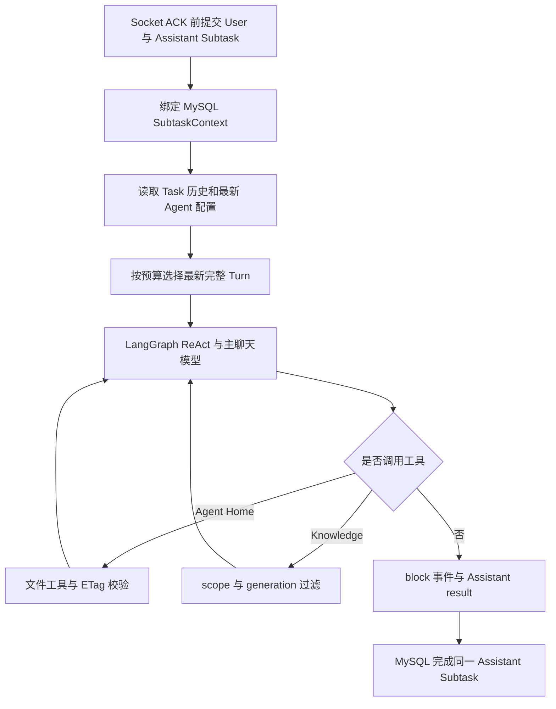

# Auto Reign 通用 Agent 平台架构

本文是 Auto Reign 的长期架构权威。当前运行方式见[项目说明](../README.md)，Knowledge Document 的入库和检索见[Knowledge Collection 数据流](knowledge-data-flow.md)，生产配置与运维边界见[生产部署](production-deployment.md)。

## 产品边界

Auto Reign 是本地优先、多账号严格隔离的通用 Agent 聊天平台。普通问答、模拟面试、学习记录或其他应用都使用同一套 Task、Subtask 和 Runtime；差异来自 Agent 配置与用户输入，不来自平台级专用会话类型或业务状态机。

当前核心能力包括：

- global/private Agent、Workspace 和 Knowledge Collection；
- 单一 `/chat?task=...` 入口、动态模型覆盖和 Socket.IO Task room；
- User Subtask 绑定的 MySQL Context；
- Agent Home 文件能力与 Knowledge 原文/RAG 检索；
- fixed `admin` 一次性初始化和普通用户管理。

认证 `user_id` 是租户边界。数据库 scope、Task room membership、Agent Home Key 前缀和 Knowledge filter 都由后端从认证用户派生；客户端不能提交 `user_id` 切换数据域。

## 核心资源

| 概念 | 配置或身份 | 生命周期 |
| --- | --- | --- |
| Agent | `system_prompt`、可选默认模型、Agent Home 和 Knowledge scope | global 或 private；Task 固定引用，下一轮读取最新配置 |
| Workspace | `workspace_type=agent_home`、`initial_agents_md` | 多个 Agent 可共享定义；文件实例按用户隔离 |
| Knowledge Collection | Retriever、mode、chunk、overlap、Top K、threshold、hybrid 权重 | 显式包含 Document；Agent 可绑定整库或子集 |
| Knowledge Document | Collection、owner、对象 Key、状态、hash、generation | 原文显式上传；解析与 Retriever 投影可重建 |
| Task | `user_id`、可选 `agent_id`、模型覆盖、状态、soft delete | 聊天任务与历史容器；首轮后 Agent 固定 |
| Subtask | Task 内单调 `message_id`、角色、状态、prompt/result | 每次输入一个 User；整次 Agent 回合一个 Assistant |
| SubtaskContext | owner、Context 类型、内容和 `subtask_id` | 草稿为 `subtask_id=0`；发送后绑定 User Subtask |

Agent、Workspace 和 Knowledge Collection 共用 `resources` 表的 owner 和生命周期列，但分别使用领域 API。Agent 对 Workspace 和 Knowledge 的引用保存在 Agent 配置中，不创建通用绑定表。

## 数据权威与投影

| 存储 | 权威职责 |
| --- | --- |
| MySQL | 用户、资源、Document 状态、Task/Subtask、Assistant result、Context 二进制/Base64/解析文本/Knowledge 选择快照 |
| ObjectStore | Agent Home 文件、Knowledge 原文和 generation 专属解析文本 |
| Redis | 活跃生成指针、流式正文、block、UTF-16 offset、取消和 Socket.IO manager；全部有界且可丢失 |
| Elasticsearch/Qdrant | Knowledge 当前 generation 的可重建 chunk 投影 |

平台共有六张业务表：

- `users`：账号、密码哈希、角色、启停、`token_version` 和管理员初始化状态；
- `resources`：Agent、Workspace、Knowledge Collection；
- `knowledge_documents`：Knowledge 对象引用、处理状态、hash 和 generation；
- `tasks`：用户、Agent、名称、状态、模型覆盖和 soft delete；
- `subtasks`：角色、顺序、父消息、状态、User prompt 或 Assistant result；
- `subtask_contexts`：草稿/绑定身份、二进制、图片 Base64、解析文本、元数据和类型数据。

聊天附件不写 ObjectStore。ObjectStore orphan audit 因此只比较 Agent Home 与 Knowledge 引用。Redis、Retriever、日志和 UI block 都不能替代 MySQL 中的 Task 历史。

## Task 与 Subtask 历史契约

一次发送在短事务中创建相邻的一对 Subtask：

1. User Subtask 保存原始输入并立即为 `COMPLETED`；
2. Assistant Subtask 保存为 `PENDING`；
3. 草稿 Context 从 `subtask_id=0` 原子绑定到 User Subtask；
4. 事务提交后 Socket ACK 返回 `task_id`、User `subtask_id` 和 `message_id`；
5. 后台执行把同一 Assistant 变为 `RUNNING`，最终进入 `COMPLETED`、`FAILED` 或 `CANCELLED`。

Assistant `result` 的稳定内容包括最终 `value`、结构化 `blocks`、`messages_chain`、`context_compactions`、来源和终止原因。`messages_chain` 按实际顺序保存 assistant 内容/tool call、匹配的 tool result、最终回答与模型信息；Task API 展开该链供 UI 渲染，但持久化单位仍是一个 Assistant Subtask。

失败重试只接受原 Task 中状态为 `FAILED` 的 Assistant。它清空旧 `result`、`error_message` 和完成时间，原地重置为 `PENDING` 后重新执行；Subtask ID 不变，也不创建 retry 记录。启动恢复把遗留 `PENDING/RUNNING` Assistant 标为 `generation_interrupted`，不自动重放可能有副作用的工具调用。

Task 的发送、模型覆盖和删除按当前状态校验；聊天链路没有额外的 Task 行锁或 advisory lock。资源绑定、停用、删除仍按各自领域服务的 MySQL 锁顺序处理，不能把两类并发协议混为一谈。

## Socket.IO Task room

网页连接 Engine.IO HTTP path `/socket.io`，再加入 Socket.IO namespace `/chat`；`/chat` 不是 Nginx HTTP location。连接使用 access token，服务端独立校验账号 active 与 `token_version`。

客户端事件包括：

- `task:join`、`task:leave`；
- `chat:send`、`chat:cancel`、`chat:retry`。

服务端事件包括 `chat:start`、`chat:chunk`、`chat:block_created`、`chat:block_updated`、`chat:done/error/cancelled` 及 Task 状态事件。流事件发到服务端控制的 `task:{task_id}` room。初次 join 返回完整 Subtask 历史；带 `after_message_id` 的重连只返回游标之后的数据，并附带 Redis 中仍存活的 active stream snapshot。

ACK 先于该轮 stream event 返回。前端以 `task_id + subtask_id + block_id + UTF-16 offset` 幂等合并；tool call、tool result 和最终回答按 block 结构展示，而不是把工具活动压成纯文本。

Redis key 使用可配置前缀和 TTL，只保存活跃流。Redis 丢失后，已完成历史仍从 MySQL 读取；进行中的 cached content 可能不可恢复，不能把 Redis 当作聊天备份。服务启动 Redis 不可用时当前实现会降级到单进程内存 stream store，生产 Compose 仍通过 healthcheck 要求 Redis 在 backend 启动前健康。

## Runtime 与 Prompt



system 层级为：

```text
平台行为协议与安全不变量
  > Agent system_prompt
  > 应用从 Agent Home 根路径读取的 AGENTS.md
  > 用户输入、Context、历史和 ToolResult
```

平台 Prompt 位于 `backend/app/prompts/platform/`。用户上传、Home 普通文件、Knowledge 原文和 ToolResult 都是不可信内容，不能改变工具 schema、权限、路径或租户隔离。

每轮用 Tool Registry 冻结当前能力集合，再构建 LangGraph `create_react_agent`。模型生成真实 `tool_call_id`，ToolResult 作为匹配 ToolMessage 进入 live graph state，并写入 Assistant `messages_chain`。Graph state 不启用持久 checkpointer，最终历史仍以 MySQL Subtask 为准。

## 上下文治理边界

当前实现使用统一 token counter：

- 从最新向前选择能完整容纳的 Turn；User、所属 Context 和 Assistant 回答不拆开；
- 当前 User Turn 必须整体容纳，否则明确返回 `context_too_large`；
- 图片按固定 reserve 计数，工具启用时预留 ToolResult 预算；
- 每次模型调用前复核 graph state，每个工具执行前后复核剩余预算；
- selected-document 只在其当前 User Subtask 执行时投影为 Knowledge 选择；普通附件文本/图片可随所属历史 Turn 使用；
- 原始 Subtask/SubtaskContext 不因预算选择而删除或改写。

`messages_chain` 支持 `compacted`、`summary_compacted`、`compaction_version`，`result` 支持 `context_compactions`，用于忠实保存 Runtime 实际提供的压缩标记。当前 Task/Subtask 阶段尚未启用生成式摘要压缩器或三阶段压缩策略，不能把这些字段解释为已经实现生成式压缩。后续实现必须保持原始 MySQL 历史不变，只治理单次 live model state，并为失败和超限提供确定性降级。

## Agent Home 与 Knowledge

Agent Home 物理身份是 `(workspace_id, effective_user_id)`，对象前缀为 `users/{effective_user_id}/workspaces/{workspace_id}/`。普通聊天不会自动写 Home；只有用户明确要求持久保存时模型才使用文件工具。已有文件写入必须携带最近读取的 ETag，根 `AGENTS.md` 可编辑但不可删除。

三类来源严格分离：

| 来源 | 持久化 | Runtime 访问 |
| --- | --- | --- |
| 聊天 Context | MySQL `subtask_contexts` | 内建 User 上下文，不是 Capability 工具 |
| Agent Home | ObjectStore | 精确 list/read/create/write 工具 |
| Knowledge | MySQL Document + ObjectStore 原文/解析文本 + Retriever 投影 | `search_knowledge(query)` |

Knowledge Document 的当前 splitter 以配置的字符 `chunk_size` 和精确 `chunk_overlap` 产生有序 source range，优先在段落、换行、中文句号、英文句号或空格处回退切分，并保存 `chunk_index/source_start/source_end`。它不会改写原文，Retriever 命中后仍回读 generation 对应的权威解析文本验证范围。更完整的数据流见[Knowledge Collection 数据流](knowledge-data-flow.md)。

## LLM 与确定性代码边界

| 环节 | 主聊天 LLM | 确定性应用代码 |
| --- | --- | --- |
| 回答、工具选择、Knowledge query | 是 | 校验 schema、长度和终止边界 |
| 身份、租户、Task room 和资源可见性 | 否 | 是 |
| Context 解析、绑定、Base64 和预算 | 否 | 是 |
| Agent Home 路径、ETag 与对象 Key | 否 | 是 |
| Document generation、Retriever/filter、chunk | 否 | 是；Embedding 模型只生成向量 |
| Task/Subtask 状态和持久化 | 否 | 是 |

LLM 不持有 DB Session、ObjectStore client、Retriever client 或 Secret，也不直接写数据库。

## 可见性与生命周期

- `resources.user_id=0` 是 global owner sentinel；正整数 owner 是 private。
- global Agent 只能引用 global Workspace/Collection；private Agent 可引用自己的 private 或 global 资源。
- Agent 停用后不再用于新 Task；已有历史可读，后续发送失败，不级联删除 Task、Home 或 Knowledge。
- 被 active Agent 引用的 Workspace/Collection 不能停用或删除；精确绑定的 Document 不能删除。
- 管理查询可以发现 inactive 资源，聊天只使用 active、未 tombstone 的资源。

空库启动事务性创建 fixed `admin` 和 create-only seed。`admin` 没有默认密码；一次性 `/setup` 完成后永久关闭。系统没有公开注册，停用或重置账号会递增 `token_version` 使旧 Token 失效。

## 运行和扩展边界

当前生产只允许一个 FastAPI/Uvicorn 进程：

- MySQL 是 Task/Subtask/SubtaskContext 与 Document 状态权威；
- Redis 提供临时 Socket.IO/stream 状态，不提供持久任务领取；
- S3-compatible ObjectStore 只保存 Agent Home 与 Knowledge 文件；
- Elasticsearch/Qdrant 只保存 Knowledge 可重建投影；
- 不部署 Kibana、Celery 或独立 Knowledge worker。

增加 backend replica 前仍需设计 Task 执行领取、幂等副作用、故障转移、Knowledge worker 协调和 shutdown handoff；已经有 Redis 不等于这些协议已经存在。

应用不会自动删除本地或远端用户数据；破坏性重置必须由操作者显式执行。
